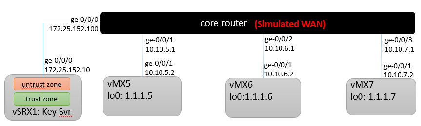

# Junos-MPLSoGREoGroupVPN
An Ansible playbook to automatically generate and/or deploy configuration files necessary to test MPLS over GRE over Group VPNv2 with vSRX and vMX.

# Diagram

# Lab Equipment
- Key Server: vSRX 15.1X49-D50
- Core Router: vSRX 15.1X49-D50
- Group VPN Members: vMX 15.1F6.9

# Pre Configuration
1. You will need to ensure you have a valid vMX license installed.
2. On Group Members, ensure 'enhanced-ip' is enabled (set chassis network-services enhanced-ip)
3. On Group Members, reboot after you enabled 'enhanced-ip'

# Running the playbook:
1. Edit the master-vars.yml file with site specific information
2. Edit group_vars/all/ files with site specific information
3. Update the inventory file with IP address information
4. a. Build and test Netconf: ansible-playbook -i inventory build.yml
4. b. Build and deploy: ansible-playbook -i inventory build_deploy.yml
5. Configuration files outputed to: ./Configs directory

